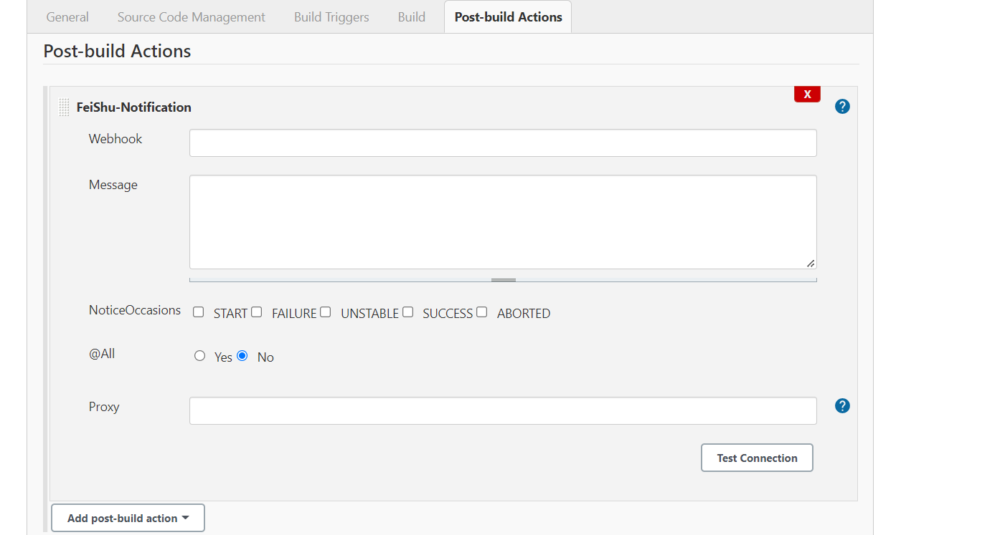
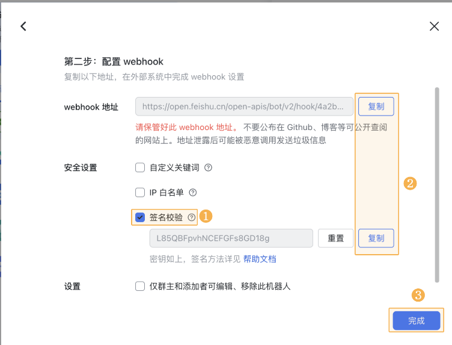
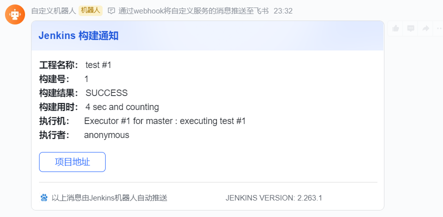

# FeiShu-Notification
Jenkins 构建消息-飞书通知插件

支持FreeStyle 和 Pipeline风格工程
## Usage

### FreeStyle风格工程用法



webhook: 填写飞书群聊机器人的webhook

添加机器人参考: https://www.feishu.cn/hc/zh-CN/articles/360024984973



Message: 填写自定义通知消息

NoticeOccassions:  通知时机，支持构建成功/失败/不稳定 时通知构建结果

Proxy: 用于内网环境，通过代理将构建结果请求转发到飞书群聊。

### Pipeline用法 

通知时机通过pipeline内置语法实现，如

声明式Pipeline
```
post {
    success {
        FeiShu(webhook:'',proxy:'',message:'',atAll:false)        
    }
    failure {
        FeiShu(webhook:'',proxy:'',message:'',atAll:false)
    }
    abort {
        FeiShu(webhook:'',proxy:'',message:'',atAll:false)
    }
}
```

脚本式Pipeline
```
catchError(message:'xxx',buildResult:'failure',stageResult:'unstable') {
    FeiShu(webhook:'',proxy:'',message:'',atAll:false)
}
```

## 效果



## Reference
部分实现参考ding talk消息通知插件
https://github.com/jenkinsci/dingtalk-plugin


